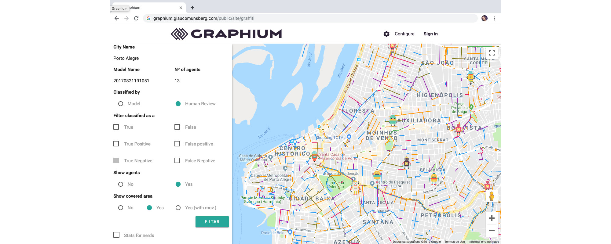
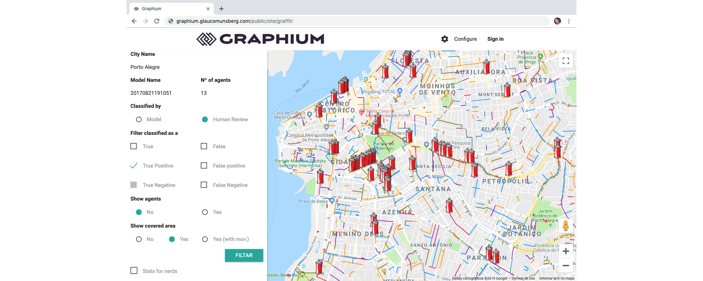

# Welcome to Graphium

Graphium help you to walk in Google Street View using IA models to find elements learned. We use multi-agent to drive in a city with [OSM](https://www.openstreetmap.org) geographic data, [Keras](https://keras.io/) models to find elements in images from Google Street View [API](https://developers.google.com/maps/documentation/streetview/intro).

*Swarm with 5 agents in Porto Alegre city*

*Graffiti detected with a swarm execution in Porto Alegre city*

## Get Code
    
If you want to get the code or contribute, go to [Graphium GitHub](https://github.com/glaucomunsberg/graphium). After get code install in [Ubuntu](about/installation/ubuntu_16.04.md) or [MacOS](about/installation/macosx_10.14.md). Go to "Installation" section after run.

#### Models
    
If you want train and test models from Keras, try [Kootstrap GitHub](https://github.com/glaucomunsberg/kootstrap). You can try your own model, [save the model](https://machinelearningmastery.com/save-load-keras-deep-learning-models/) at `data/models/` and set the name on `configs/oracle.json`.

## Project layout

Below we show the structure to dataset, applications and documentation

    data/           # folder with all data generate by applications.
        configs/
        datasets/
        logs/
        models/
        pictures/
    applications/   # applications suches crawler, analyzers etc
        swarm/
        webserver/
    docs/           # documentation of Graphium
    mkdocs/         # generator of docs
