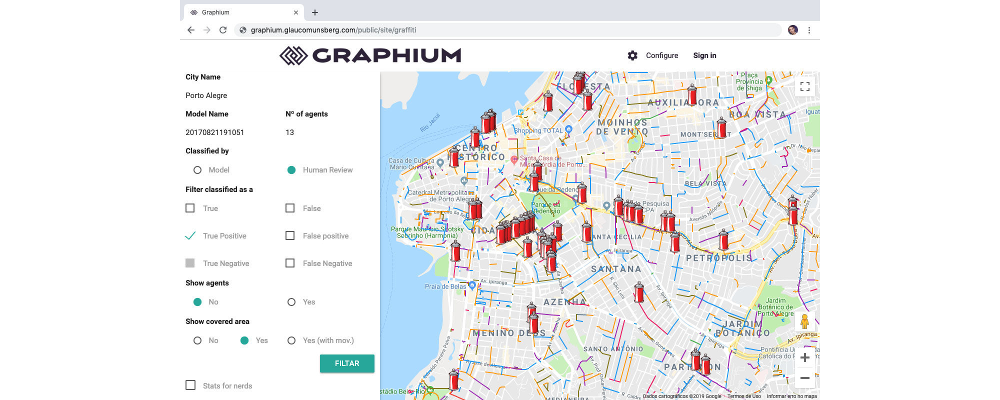

# WebServer

Webserver help to list and manipulate information from [Swarm](../swarm/index.md) executions.

*Graffiti detected with a swarm execution in Porto Alegre city*

*Graffiti detected with a swarm execution in Porto Alegre city*

## Applications

At web server you can find applications such [image classifier](image_classification.md), [real time swarm](realtime.md) and [classified imagens](image_classified.md) by each swarm.

## Run

Go to [Execution Section](../about/execution.md) to read more.